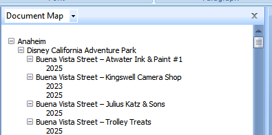
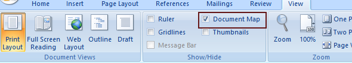
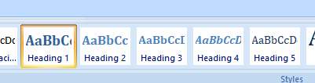
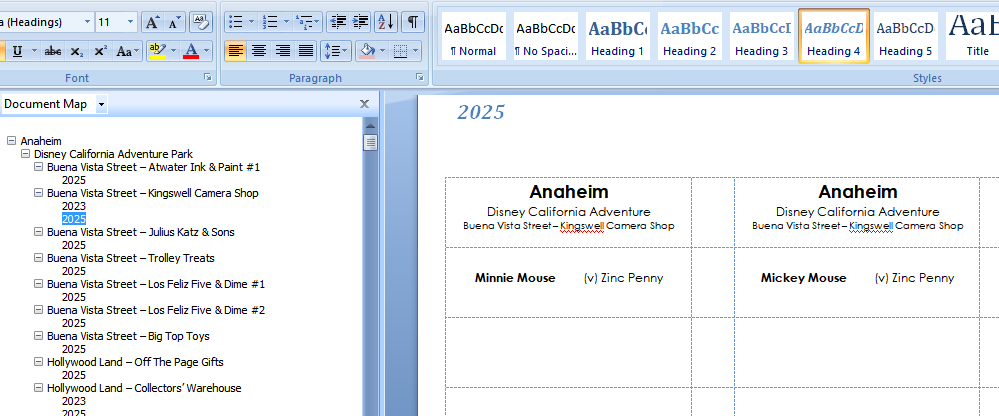
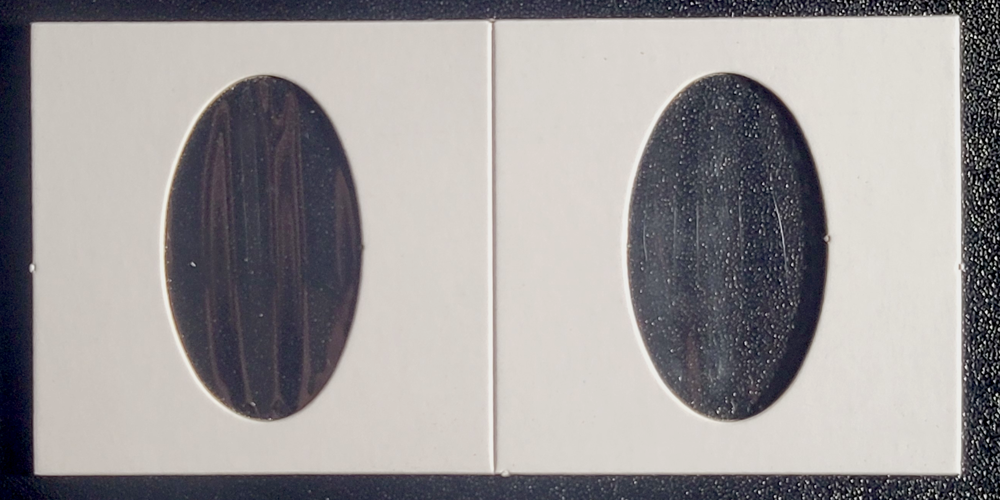
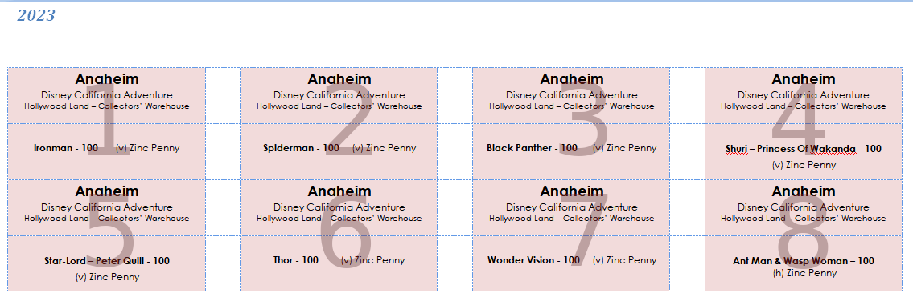
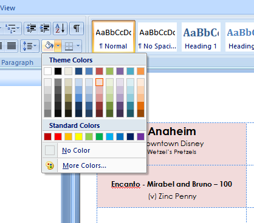
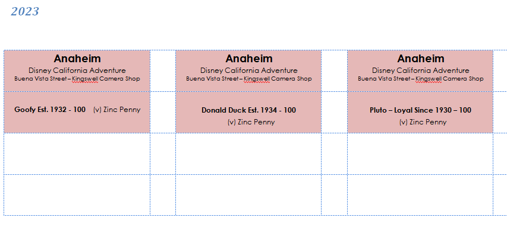

# pennywise

Pennywise is a python script used to pull label data out of word documents and output them into some other format (csv). 

I manage my elongated coin/flattened penny collection via a labeling system I've developed in Microsoft Word.  This system uses a well established UI, keeps things consistent, and allows me to keep track of my collection over time. It uses out of the box functionality to keep things simple.

Why Microsoft Word? I use [Avery 5167 Easy Peel Return Address Labels](https://www.avery.com/products/labels/5167) which comes with Microsoft Word templates avery.com/templates. These templates lend themselves well for labeling, organization, and consistency.

## Getting Started

Pennywise is a standalone executable—no Python installation or virtual environment needed!

1. Go to the [Releases](../../releases) page and download the latest `pennywise` executable
2. Place your Word document (.docx) in the same folder as the executable
3. Run the command:
   ```bash
   ./pennywise --input your_file.docx --output output.csv
   ```

That's it! Your labels will be extracted to a CSV file.

## How It Works

Pennywise reads [specially formatted Word documents](./pennies/labels/ca.docx) where labels are organized using Word's built-in Heading styles. It extracts the label hierarchy (State → City → Neighborhood → Location → Year) and converts it into a CSV file for easy analysis and tracking.

## The methodology

While it is possible to put everything in a single file, I organize my collection by state because it's easier to manage. I will use the [ca.docx (California)](./pennies/labels/ca.docx) file in all of my examples. You can take this document and customize it to your needs

### Document Map
The Document Map is a Microsoft Word feature that allows me to navigate large documents and organize the labels in a hierarchical collection. 



You can usually view the Document Map by selecting the View Tab and checking the Document Map checkbox. 




The hierarchy is defined/mainaged/maintained by using Microsoft Word's built-in header functionality as shown below, and is broken down like:




Heading 1 = City

Heading 2 = Neighborhood or Location

Heading 3 = Location

Heading 4 = Year

You can see how this aligns well with the objectives



#### Heading 1 = City
This is pretty self-explanatory. I like to organize my collection by State and then City. 

> A drawback to using Microsoft Word is that sorting doesn't happen automatically. However, Microsoft Word is pretty forgiving with copying and pasting. 

#### Heading 2 = Neighborhood or Location
The Neighborhood/Location breakdown makes a lot of sense until it doesn't, so there is some flexibility here depending on the situation. In the [ca.docx file](./pennies/labels/ca.docx) example, Disneyland isn't a neighborhood, it's an amusement park in Anaheim. In Long Beach, Shoreline Village is a location, that has other locations within it, so Shoreline Village becomes the neighborhood. In San Francisco Chinatown is an actual neighborhood. So, you can see the issue here. The neighborhood scenario shows up more often in the documents than the amusement park, so this script leans towards neighborhood/location scenario even if everything doesn't fit nicely into that categorization

**Rule of thumb**

If a Heading 2 has Heading 3 below it, the Heading 2 becomes the Neighborhood. If there are no Heading 3 under the Heading 2, Heading 2 is the location. 

Heading 2 as Neighborhood
```txt
    H2 Downtown Disney         <= Neighborhood
        H3 World of Disney     <= Location
            H4 2024            <= Year
            H4 2025            <= Year
        H3 Wetzel's Pretzles   <= Location
```

Heading 2 as Location
```txt
    H2 Cameron’s Restaurant, Pub & Inn         <= Location
```

#### Heading 3 = Location
Location can hold more data than just the actual location itself, however, I treat everything like a location regardless. While `Pier 45 - Musée Mécanique Museum – Original #1` in the Fisherman's Wharf Neighborhood of San Francisco contains the Pier Number, and the actual location (building) of the machine, and the penny machine, I treat the entire string as the location. This is the way I've chosen to capture this information, primarily because this data changes over time or gets lost along the way. In the `Musée Mécanique Museum` example, they collect machines from defunct locations around San Francisco. When I got the penny, it was at the museum, but I want to capture the original location e.g. `Pier 45 - Musée Mécanique Museum – Maritime National Historic Park`

#### Heading 4 = Year
Particularly in the [ca.docx file](./pennies/labels/ca.docx), Disney tends to feature new, yearly pennies. The year header allows for me to capture the different versions that come out each year. Disney annual pennies tend to be tied to the same locations year after year, but not exclusively. The system is flexible enough to handle these types of scenarios.   

## Labels
I label all of my coins. I use [elongated coin flips from Coin Supply Express](https://www.coinsupplyexpress.com/guardhouse-2-x-2-elongated-penny-coin-flips-781760). Each label consists of a top and bottom. [Avery 5167 Easy Peel Return Address Labels](https://www.avery.com/products/labels/5167) are especially well suited for space requirements on the coin flips.




Each label in the [ca.docx](./pennies/labels/ca.docx) word doc consists of a top and bottom. These labels can be customized to suit your needs (spacing, colors, fonts, font sizes, etc.). Whatever you desire. 

### Position
Coin position is a judgement call, especially for wheels where there is no labeled order. For me, whatever is first listed on the websites I use for verification/labeling tends to be the first position. I personally maintain positioning when dealing with incomplete sets. It helps me target the things I've missed if/when I get back to the machine. The labeling methodology lends itself well to maintaining positioning. The following image details positions. The position scenario scales well where machines vend more than 4 or 8 pennies. 



### Retired
I delineate retired pennies by filling the label table cells with the Red Accent 2 80%


Retired Example:


It allows for me to easily see what is retired while looking at the document. 

## Usage

Once you have the pennywise executable, navigate to the directory you extracted it, you can use it like:

```bash
pennywise --input file.docx --output file.csv [options]
```

### Command-line Flags

| Short | Long | Description |
|-------|------|-------------|
| `-i` | `--input` | Path to input .docx file (required) |
| `-o` | `--output` | Path to output .csv file (required) |
| `-sl` | `--short-location` | Keep Short Location if present (e.g., "Big Top Toys" instead of "Buena Vista Street - Big Top Toys") |
| `-mld` | `--multi-line-dash` | Allow dash separator in multi-line descriptions (e.g., "The Aristocats\n Something" becomes "The Aristocats - Something") |
| `-n` | `--new-only` | Only extract NEW pennies not already in the database |
| `-h` | `--help` | A help message of all flags |

### Examples

short form
```shell
./dist/pennywise -i input.docx -o output.csv
```

Long form
```shell
./dist/pennywise --input input.docx --output output.csv
```

List of new pennies since last time run
```shell
./dist/pennywise --input input.docx --output new.csv --new-only
```

Process all files in a directory:
```shell
./dist/pennywise --input ./pennies/labels/ --output all_new.csv --new-only
```

To get a list of all available flags:
```shell
./dist/pennywise --help
```

## Features

### Word Specific Unicode Characters
Word does some things well, however, those things don't always translate well outside of Word. The script will attempt to normalize Word specific Unicode characters (e.g. Quotes, ", '), to their ASCII equivalent so they are universal. 

### Process All Documents In A Directory
The script has the ability to process all documents in a folder. This should make things easier when looking for all the new entries when adding to the collection

### Label Logging
The script will compare the Document Map and the Labels against one another to ensure consistency. When doing things at scale, mistakes happen. The `labels.log` file will log any of 3 types of inconsistencies with the Document Map and the Labels: City, Neighborhood, and Location. Log entries look like:

```shell
============================================================
Mismatch for Anaheim Downtown Disney World Of Disney
  Location Mismatch:
    Document Map Location: 'Downtown Disney - World of Disney'
    Parsed Label Location: 'Downtown Disney - World Of Disney'
2026-02-05 19:47:16,684 - WARNING - parse_docx_to_rows:712 - 
============================================================
```
```shell
============================================================
Mismatch for Half Moon Bay Half Moon Bay Sports Fishing And Tackle Shop
  Neighborhood Mismatch:
    Document Map Neighborhood: ''
    Parsed Label Neighborhood: 'Half Moon Bay Sports Fishing'
2026-02-05 19:47:17,347 - WARNING - parse_docx_to_rows:712 - 
============================================================
```

This should make identifying inconsistencies easier when working at scale


### Internal Database
There is a SQLite 3 database to keep track of previously extracted pennies. The script hashes a combination of label fields to generate uniqueness. The fields it uses are: `State`, `City`, `Location`, `Name`, and `Orientation`. If you are doing things at scale, this feature is helpful in identifying new pennies that have been added to the documents over time. e.g.

```shell
./dist/pennywise --input input.docx --output new.csv --new-only
```

There is a caveat with this approach,  a cryptographic hash is different when you hash words like `Foo` vs `foo`, even though the words are semantically the same. Any label changes to the previous fields will generate new hashes and could produce false positives in the output. **Be sure to verify the output!**


